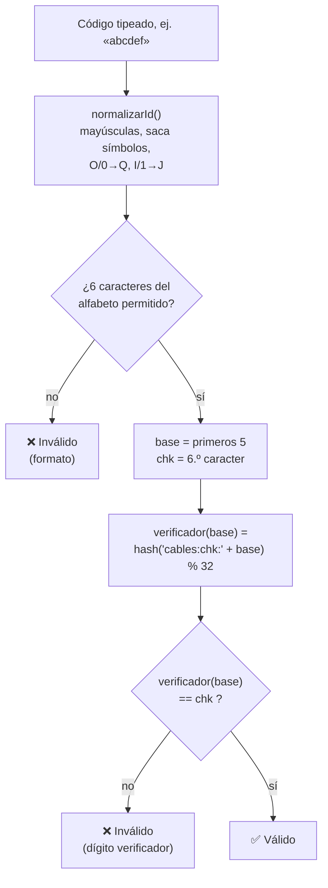
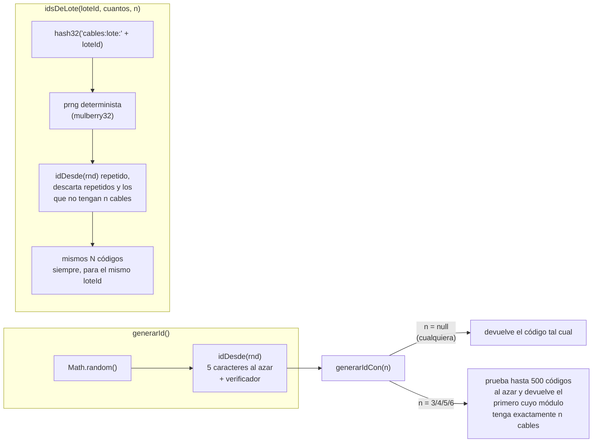
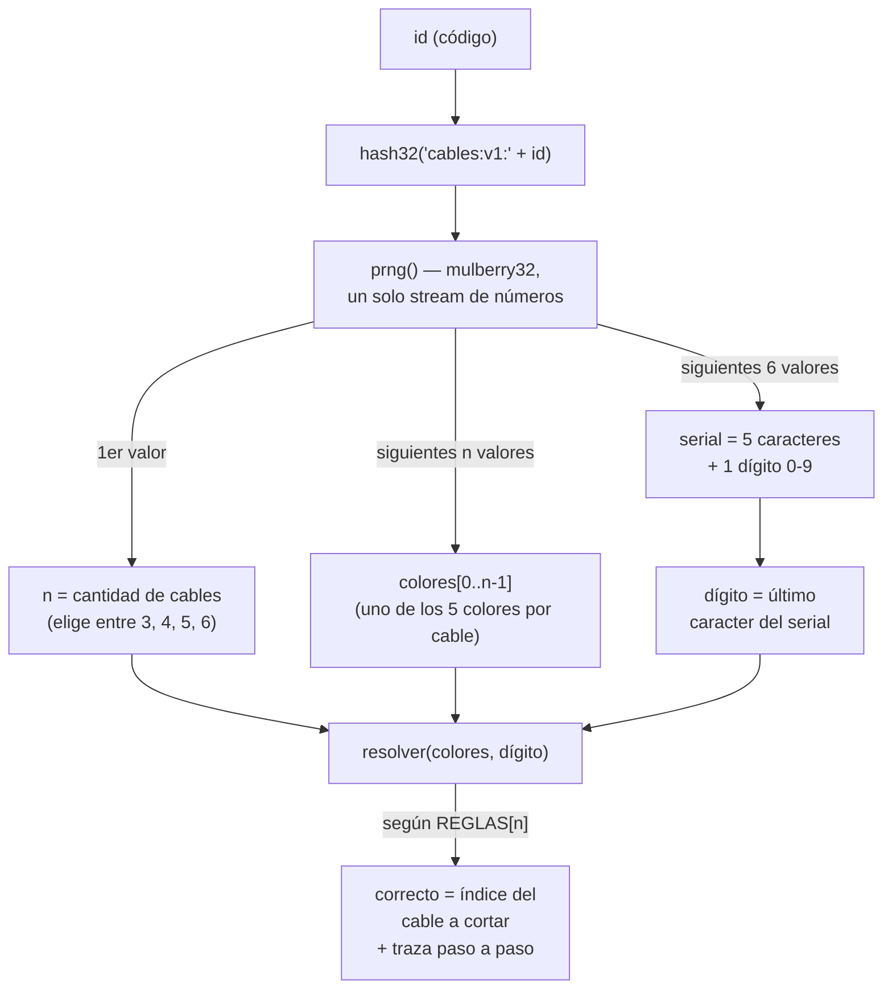
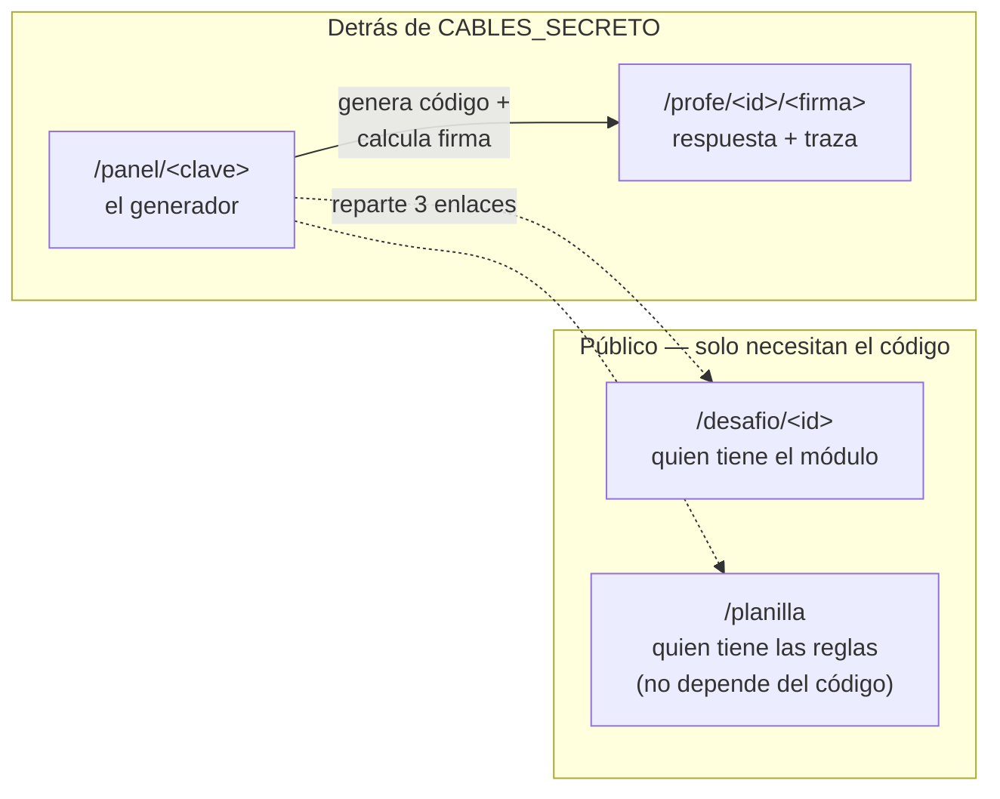

# Módulo de Cables — cómo funciona

Todo lo que ve cada rol (el grupo con el módulo, el grupo con la planilla,
el o la docente) se deriva de un único **código de 6 caracteres**. El
código es la semilla: mismo código ⇒ mismos cables, mismo serial, misma
respuesta, siempre y en cualquier dispositivo. No hay base de datos ni
estado guardado en el servidor — todo se recalcula a partir del código
en cada request.

## ¿Qué hace que un código sea válido?

Un código válido tiene dos condiciones, ambas en [`motor.ts`](./motor.ts):

1. **Alfabeto y longitud** — 6 caracteres de un alfabeto de 32 símbolos
   que excluye `I`, `O`, `0` y `1` a propósito, porque se confunden entre
   sí al escribirlos a mano o leerlos en voz alta:

   ```
   ABCDEFGHJKLMNPQRSTUVWXYZ23456789
   ```

2. **Dígito verificador** — el 6.º caracter no es libre: es una función
   determinista de los primeros 5 (`verificador()`, un hash de
   `"cables:chk:" + base`). Si alguien tipea mal una letra, el dígito ya
   no coincide y el código se rechaza en vez de mostrar silenciosamente
   un módulo distinto al del compañero.

Por eso una cadena inventada como `ABCDEF` casi siempre es inválida: la
chance de que el 6.º caracter puesto al azar coincida con el verificador
es 1 en 32. Solo son válidos los códigos que salieron de `generarId()` (o
de tipear a mano uno que sí salió de ahí).



`normalizarId` corrige antes de validar: pasa a mayúsculas, descarta
cualquier caracter que no sea letra o número, y reemplaza `O`/`0` → `Q`
e `I`/`1` → `J` (los vecinos visuales dentro del alfabeto permitido). Si
esa corrección cambia una letra que en realidad era otra, el dígito
verificador ya no va a coincidir — así que el peor caso de un error de
tipeo es "inválido", nunca "te lleva al módulo equivocado en silencio".

## Cómo se genera un código nuevo



- **Botón "Generar código nuevo"** → `generarIdCon`: usa `Math.random`,
  no es reproducible — cada clic da un código distinto.
- **Lote de códigos para varios grupos** → `idsDeLote`: la semilla es un
  hash del id del lote (código activo + cantidad de grupos + filtro de
  cables), así que recargar la tabla o volver más tarde da **los mismos**
  códigos — necesario para no invalidar los que ya se repartieron.

La cantidad de cables (3 a 6) **no está codificada** en los caracteres
del id: es parte de lo que sale de la semilla al derivar el módulo (ver
abajo), así que buscar "un código con 4 cables" es prueba y error, no
lectura directa.

## De un código a un módulo completo

`moduloDesdeId(id)` es la única función que arma el módulo. Todo lo que
sigue sale de un solo PRNG semillado con `hash32("cables:v1:" + id)`, en
un orden fijo — por eso el mismo id siempre reproduce exactamente lo
mismo:



`resolver()` recorre `REGLAS[n]` en orden y se detiene en la primera regla
cuyo `test` da verdadero; `indice` de esa regla es el cable correcto. La
`traza` marca cada regla como **aplica** (la que ganó), **descartada**
(se evaluó y no cumplía) o **no evaluada** (nunca se llegó a mirar,
porque una anterior ya había resuelto el módulo). Esa traza es
exactamente lo que renderiza `TrazaReglas` en la hoja del profe — la
planilla que imprime el grupo y el motor que resuelve comparten el mismo
array `REGLAS`, así que no pueden divergir.

## Quién puede ver qué

Tres roles, tres niveles de protección distintos ([`rutas.ts`](./rutas.ts),
[`secreto.ts`](./secreto.ts)):



- **`/desafio/<id>`** y **`/planilla`** son públicas a propósito: son las
  vistas que efectivamente se le pasan a cada grupo. La planilla ni
  siquiera lleva el código en la URL, porque las reglas son las mismas
  para todo el taller.
- **`/panel/<clave>`** es el generador; `clave` se compara contra
  `CABLES_SECRETO` con `timingSafeEqual` (no filtra por cuánto tarda en
  fallar). Sin esa clave no se puede generar códigos ni ver respuestas.
- **`/profe/<id>/<firma>`** es la hoja de un módulo puntual. La `firma`
  son los primeros 8 caracteres de `HMAC-SHA256(secreto, "cables:profe:" + id)`,
  mapeados al mismo alfabeto de 32 símbolos (256 bits es múltiplo exacto
  de 32, así que no hay sesgo). Sirve para pasarle el enlace de **un**
  módulo a otro docente sin entregarle la clave maestra — con la firma
  sola no se puede generar códigos nuevos ni ver otros módulos.

Sin `CABLES_SECRETO` configurada, el panel y las hojas de profe siguen
funcionando pero con un secreto por defecto conocido — usable en
desarrollo, no para dar clase; las vistas de docente avisan en pantalla
cuando pasa esto.
